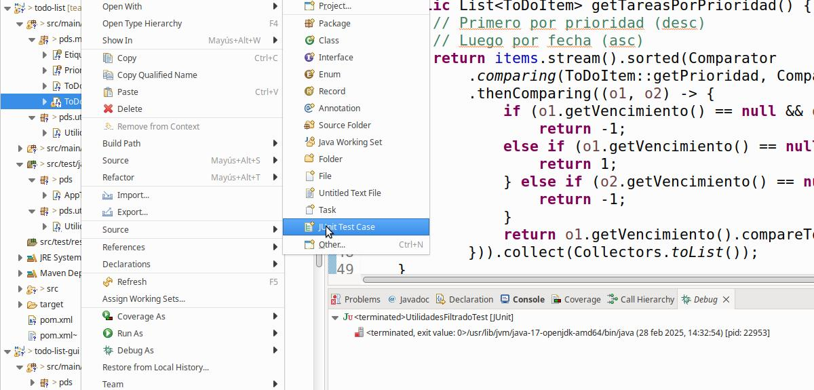
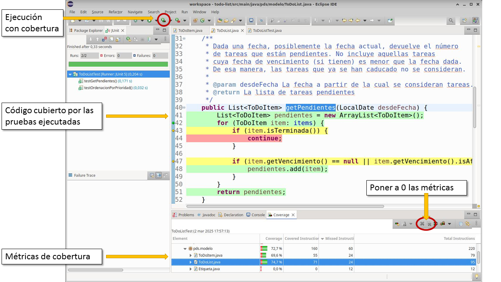

# Práctica — Pruebas de Software sobre TPV-API
En esta práctica vamos a trabajar cómo probar software de manera profesional en Java a partir de nuestro proyecto TPV.

El objetivo es aprender a configurar herramientas de testing para integrarlas en nuestro flujo de desarrollo y mejorar la calidad del software mediante pruebas sistemáticas y automatizadas.

Durante la práctica trabajaremos con diferentes técnicas de pruebas:
1. Pruebas unitarias de caja negra con JUnit para validar especificaciones sin depender de la implementación.
2. Pruebas de caja blanca utilizando la medición de la cobertura de código con JaCoCo para evaluar qué partes del sistema están realmente probadas.
3. Pruebas de integración para verificar la colaboración entre distintos componentes del software.
4. Uso de mocks para simular dependencias y mejorar el aislamiento de las pruebas.
5. Pruebas de sistema con Spring Boot para validar el comportamiento completo de una API.

Para esta práctica, utilizaremos la API REST para gestionar el inventario y las ventas de una frutería (**TPV-API**) que se ha utilizado en prácticas anteriores.
La aplicación sigue una arquitectura hexagonal con las capas habituales: dominio, aplicación y adaptadores y dispone
de una base de datos (H2, en memoria) que, al arrancar, inicializa **30 productos** con códigos del 101 al 130 
(Los nuevos productos creados durante la ejecución recibirán códigos a partir del 131).

#### **Índice de la práctica**
 0. [Configuración y dependencias Maven](#maven)
 1. [Introducción a las pruebas con JUnit](#junit)
 2. [Pruebas de caja negra](#blackbox)
 3. [Pruebas de caja blanca](#whitebox)
 4. [Pruebas de integración](#integracion)
 4. [Pruebas de integración con Mockito](#mocks)
 6. [Pruebas con SpringBoot](#springboot)

---

## PARTE 00. Configuración y dependencias Maven <a name="maven"></a>
Antes de comenzar a escribir pruebas para el proyecto, es necesario configurar Maven para que incluya las dependencias a JUnit. JUnit es el framework de pruebas que se utilizará.

En el POM del proyecto hay que incluir las dependencias de JUnit (*es posible que el proyecto ya lo incluya*). 

```xml
  <properties>
    <junit.version>5.11.0</junit.version>
  </properties>

  <dependencies>
      <dependency>
      <groupId>org.junit.jupiter</groupId>
      <artifactId>junit-jupiter-api</artifactId>
      <version>${junit.version}</version>
      <scope>test</scope>
    </dependency>

    <!-- Soporte para tests parametrizados -->
    <dependency>
      <groupId>org.junit.jupiter</groupId>
      <artifactId>junit-jupiter-params</artifactId>
      <version>${junit.version}</version>
      <scope>test</scope>
    </dependency>
  </dependencies>
```

Las dependencias son:
* `junit-jupiter-api`: Proporciona la API principal de JUnit 5 para escribir pruebas.
* `junit-jupiter-params`: Agrega soporte para pruebas parametrizadas, lo que permite ejecutar un mismo test con diferentes valores de entrada.
* `<scope>test</scope>`: Indica que estas dependencias solo se usarán en la fase de pruebas y no estarán en el código de producción.
* La versión concreta de JUnit se guarda en una propiedad `junit.version` para asegurar que cuando se cambie, cambie de igual manera en todas las dependencias relacionadas con JUnit.

JUnit proporciona una pequeña librería de asertos estandar, como `assertTrue`, `assertEquals`, etc. 

<!--
En ocasiones, es necesario escribir asertos más complejos y es útil utilizar librerías especializadas.
En este caso, utilizaremos [AssertJ](https://assertj.github.io/doc/).

Para incluir `AssertJ` en el proyecto, incluye en el POM:

```xml
<dependency>
  <groupId>org.assertj</groupId>
  <artifactId>assertj-core</artifactId>
  <version>3.27.2</version>
  <scope>test</scope>
</dependency>
```
-->

#### NOTA sobre configuración adicional de Eclipse:
En algunas instalaciones de Spring Tools For Eclipse, el plugin de JaCoCo no se instala por defecto. Esto hace que no se puedan ejecutar los tests con cobertura de código.
Para instalarlo, simplemente con buscar 'jacoco' en el Eclipse Marketplace sale el plugin ```EclEmma Code Coverage``` e instalarlo. 

#### 🟢 Ejercicio: Configuración de tu proyecto
1. Incluye las dependencias de jUnit en tu proyecto.
2. Instala el plugin de JaCoCo.

---

## PARTE 01. Introducción a las pruebas con JUnit
<a name="junit"></a>
Las pruebas las realizaremos con JUnit que es el framework de pruebas más utilizado en Java. En particular,
utilizaremos la versión JUnit 5.

En JUnit 5, los tests se escriben en clases Java normales donde cada test (caso de prueba) es un método anotado con `@Test`. 
Puesto que estamos utilizando Maven, los tests se escribirán en la carpeta `src/test/java`. 
La convención es escribir el nombre de la clase clase con el sufijo `Test` (ej., `EjemploTest`).

Para ejecutar el código de pruebas hay varias opciones:
* Sobre una clase que implementa un _test case_, `Botón derecho -> Run as -> JUnit test`. 
* Utilizando un _Run configuration_. En el botón  , pulsar la flecha hacía abajo para ver las configuraciones creadas o para crear una nueva.
* Sobre un proyecto, `Botón derecho -> Run as -> JUnit test`, ejecutará todos los tests del proyecto.
* Desde la línea de comandos, utilizando Maven se podrán ejecutar todos los tests del proyecto con:

```bash
  $ mvn test
```

#### 🟢 Ejercicio: Familiarizate con JUnit
1. Crea el paquete ```pds.prueba``` en la carpeta ```src/test/java``` y copia el siguiente código.
2. Prueba a ejecutar la clase de prueba ```EjemploTest``` y examina los diferentes tipos de asertos.

```java
package pds.prueba;

import static org.junit.jupiter.api.Assertions.*;
import org.junit.jupiter.api.Test;

class EjemploTest {

    @Test
    void testAserciones() {

        // 1. Comprobación de igualdad (esperado, actual)
        assertEquals(2, 1 + 1, "Mensaje opcional de error");
        assertNotEquals(3, 1 + 1);

        // 2. Comprobación de condición
        assertTrue(5 > 3);
        assertFalse(5 < 3);

        // 3. Comprobación de nulo
        Object object = null;
        assertNull(object);
        assertNotNull("Hola");

        // 4. Comprobación de referencia (mismo objeto)
        String s1 = "test";
        String s2 = s1;
        assertSame(s1, s2);
        assertNotSame(new String("test"), new String("test"));

        // 5. Prueba de excepciones (valida el tipo de excepcion)
        // Se utiliza para comprobar que un método valida precondiciones correctamente
        assertThrows(ArithmeticException.class, () -> {
            int result = 10 / 0;
        });

        // 6. Aserciones agrupadas (todas deben pasar)
        assertAll("Persona",
            () -> assertEquals("John", "John"),
            () -> assertEquals("Doe", "Doe")
        );
    }
}
```

---

## Parte 02: Pruebas de Caja Negra
<a name="blackbox"></a>

Las pruebas de **caja negra** se diseñan en base a la especificación y no de la implementación.

En el código de **tpv-api** tenemos el agregado `Producto`. Actualmente tiene poca funcionalidad, pero
la vamos a extender con funcionalidad adicional para gestionar descuentos. 

Se van a crear dos métodos:
- Método `Producto.tieneDescuento`.
  - **Especificación**: Un producto tendrá un descuento sobre su precio si su stock es menor que 3. 
- Método `Producto.getDescuento()`.
  - **Especificación**: El descuento de un producto será del 20% si hay un producto y el 10% si hay 2 o 3 productos en el stock.  
- **NOTA:** La especificación de los códigos de los productos dice que: los códigos de producto <= 100 están **reservados**. 

#### Organización de los casos de prueba
Por cada caso de prueba se suele escribir un método anotado con `@Test`. En cuanto a la organización de los casos de prueba, no hay una única forma de hacerlo. Sin embargo, una práctica común es escribir un método de test por cada combinación de método a probar y clase de equivalencia.

#### 🟢 Ejercicio: Creación de casos de prueba
Identifica las clases válidas e inválidas para la creación de value objects `ProductoId` y las clases de equivalencia para los métodos
`Producto.tieneDescuento` y `Producto.getDescuento()`.

Crea la clase `ProductoTest`. Debe estar en la carpeta `src/test/java`. Puesto que se está probando la clase `Producto`, la convención

A continuación:
1. **Identifica las clase de equivalencia y clases válidas e inválidas**: Identifica las clases válidas e inválidas para la creación de value objects `ProductoId` y las clases de equivalencia para los métodos `Producto.tieneDescuento` y `Producto.getDescuento()`.
2. **Crea los casos de prueba**. Crea la clase `ProductoTest` (en la carpeta `src/test/java`). Puesto que se está probando la clase `Producto`, la convención
es poner la clase en el mismo paquete (`inf.pds.tpv.domain.model.producto`).

#### AYUDA:
Para añadir una clase de prueba a una clase dada, puedes hacerlo automáticamente utilizando lo siguiente: `Botón derecho sobre el fichero de la clase, New -> JUnit Test Case`

<p align="center">
  
</p>

<p align="center">
<strong>Figura 1.</strong> ¿Cómo crear un nuevo caso de uso?
</p>

Escribe un método anotado con ```@Test``` por cada caso de prueba. A continuación, se muestra un ejemplo (recuerda hacer lo mismo para ```ProductoIdTest```).

```java
package inf.pds.tpv.domain.model.producto;

import static org.junit.jupiter.api.Assertions.*;

import org.junit.jupiter.api.Test;

class ProductoTest {

	@Test
	void testProductoConDescuento() {
		fail("No implementado");
	}

   @Test
	void testProductoSinDescuento() {
		fail("No implementado");
	}
	
	// ...
}
```

---

## Parte 03. Pruebas de caja blanca con JaCoCo
<a name="whitebox"></a>

Para inspeccionar la cobertura del código que  consiguen los casos de prueba creados se utilizará la herramienta [JaCoCo](https://www.jacoco.org/jacoco/).

JaCoCo ofrece varios tipos de [contadores](https://www.jacoco.org/jacoco/trunk/doc/counters.html) que utiliza para calcular varias métricas de cobertura. 

La siguiente imagen muestra la interfaz gráfica de JaCoCo cuando se usa como plug-in de Eclipse. La interfaz gráfica ofrece un botón para ejecutar tests utilizando JaCoCo lo que hace que se "instrumente" el código de la aplicación y JaCoCo pueda saber qué instrucciones se han ejecutado. [Una vez ejecutadas las pruebas, se muestra en el editor con diferentes colores qué partes se han ejecutado](https://www.cs.cornell.edu/courses/JavaAndDS/files/codeCoverage.pdf).
Por último, en la vista "Coverage" se muestran las métricas de cobertura (abajo).



Es importante destacar que los contadores que usa JaCoCo está implementados a nivel del bytecode de Java, por lo que a veces los resultados no se pueden "mapear" de manera precisa al código fuente original.

En esta práctica se utilizarán estas dos métricas:

* **Cobertura de sentencias/líneas**. En una línea puede haber varias instrucciones y JaCoCo reporta tres situaciones.

  - Sin cobertura (<span style='color: red'>rojo</span>). No se ha ejecutado ninguna instrucción de esa línea.

  - Cobertura parcial (<span style='color: yellow'>amarillo</span>). Se han ejecutado algunas instrucciones de esa línea, pero no todas.

  - Coberatura total (<span style='color: green'>verde</span>). Se han ejecutado todas las instrucciones de la línea.

* **Cobertura de ramas**.

  - Sin cobertura (<span style='color: red'>diamante rojo</span>). El condicional de esa línea no se ha ejecutado.

  - Cobertura parcial (<span style='color: yellow'>diamante amarillo</span>). Se ha ejecutado alguna de las ramas del condicional (ej., una rama en un `if-else`). 

  - Cobertura total (<span style='color: green'>diamante verde</span>). Se han ejecutado todas las ramas del condicional.


### 🟢 Ejercicio:  Ejecutar pruebas con cobertura de código desde Eclipse
<a name="whitebox.eclipse"></a>

Ejecuta los tests anteriores utilizando la herramienta de cobertura JaCoCo que se ha mostrado en la imagen anterior. Estudia la salida y relaciona los casos de prueba con la cobertura obtenida (ej., líneas amarillas y rojas). Intenta conseguir un 100% de cobertura de sentencias y de ramas en los tests de `ProductoTest` y `ProductoIdTest`.

**Importante**: A la hora de ejecutar las pruebas es importante tener en cuenta que si solo se ejecuta clase de prueba, la herramienta de cobertura muestra la cobertura para esa clase solamente. Para ver la cobertura de todo el proyecto, hay que ejecutar las pruebas tal y como se indicó antes: `Botón derecho en el proyecto -> Run as -> JUnit test`.


#### Ejecutar con cobertura de código de Maven
Para poder ejecutar las pruebas de caja blanca en Maven, hay que modificar la configuración del proyecto para que incluya la instrumentación de JaCoCo.
A continuación, se muestra la configuración que debes incluir en el fichero `pom.xml`:

```xml
<plugin>
  <groupId>org.jacoco</groupId>
  <artifactId>jacoco-maven-plugin</artifactId>
  <executions>
    <execution>
      <goals>
        <goal>prepare-agent</goal>
      </goals>
    </execution>
    <execution>
      <id>report</id>
      <phase>test</phase>
      <goals>
        <goal>report</goal>
      </goals>
    </execution>
  </executions>
</plugin>
```

Con esta configuración, al ejecutar `mvn test` se ejecutarán los tests con la instrumentación de JaCoCo y se generará un informe de cobertura en `target/site/jacoco/index.html` que se puede abrir con el navegador.

Utiliza esta configuración y comprueba en el informe generado que obtienes el mismo resultado que utilizando la interfaz gráfica de Eclipse.

---

## Parte 03. Pruebas de integración 
<a name="integracion"></a>
Para poder probar ```StockServiceImpl``` es necesario disponer de implementaciones de sus dependencias,
en este caso ```ProductosRepository```. Puesto que estamos utilizando una arquitectura hexagonal, es relativamente
sencillo construir un _test_ con repositorios *falsos* (ej., en memoria).

Por ejemplo, en el siguiente ejemplo se construye un repositorio en memoria para poder probar el servicio
```StockServiceImpl```, en particular el método ```crearNuevoProducto```.

```java
package inf.pds.tpv.application.usecases.stock;

import java.util.ArrayList;
import java.util.HashMap;
import java.util.List;
import java.util.Map;
import java.util.Optional;

import static org.junit.jupiter.api.Assertions.*;
import org.junit.jupiter.api.BeforeEach;
import org.junit.jupiter.api.Test;

import inf.pds.tpv.domain.model.producto.Producto;
import inf.pds.tpv.domain.model.producto.ProductoId;
import inf.pds.tpv.domain.model.producto.ProductoId.IdentificadorProductoException;
import inf.pds.tpv.domain.ports.input.stock.commands.CrearProductoCommand;
import inf.pds.tpv.domain.ports.output.ProductosRepository;

public class StockServiceImplTest {

    private StockServiceImpl servicio;
    private ProductosRepositoryEnMemoria repository;

    @BeforeEach
    void setUp() {
        repository = new ProductosRepositoryEnMemoria();
        servicio = new StockServiceImpl(repository);
    }

    @Test
    void testCrearProducto() {
        CrearProductoCommand c = new CrearProductoCommand("prueba", 10, 100.0);
        Producto p = servicio.crearNuevoProducto(c);
        
        assertEquals("prueba", p.getDescripcion());
        assertEquals(100.0, p.getPrecio());
        assertEquals(10, p.getCantidad());
     
        Producto encontrado = repository.obtenerProductoPorId(p.getIdentificador().getCodigoNumerico()).get();
        assertEquals("prueba", encontrado.getDescripcion());
        assertEquals(100.0, encontrado.getPrecio());
        assertEquals(10, encontrado.getCantidad());
    }
    
    private static class ProductosRepositoryEnMemoria implements ProductosRepository {
    	private Map<ProductoId, Producto> datos = new HashMap<>();
    	
		@Override
		public List<Producto> obtenerTodosProductos() {
			return new ArrayList<>(datos.values());
		}

		@Override
		public Producto crearNuevoProducto(Producto producto) {
			try {
				Producto nuevoProducto = new Producto(ProductoId.of(101 + datos.size() * 1L),
						producto.getDescripcion(), producto.getCantidad(), producto.getPrecio());
				datos.put(nuevoProducto.getIdentificador(), nuevoProducto);
				return nuevoProducto;
			} catch (IdentificadorProductoException e) {
				throw new IllegalStateException(e);
			}
		}

		@Override
		public Producto editarProducto(Producto producto) {
			datos.put(producto.getIdentificador(), producto);
			return producto;
		}

		@Override
		public void eliminaProducto(Producto producto) {
			datos.remove(producto.getIdentificador());
		}

		@Override
		public Optional<Producto> obtenerProductoPorId(Long id) {
			try {
				return Optional.ofNullable(datos.get(ProductoId.of(id)));
			} catch (IdentificadorProductoException e) {
				throw new IllegalStateException();
			}
		}

		@Override
		public List<Producto> filtrarProductos(String filtro) {
			throw new UnsupportedOperationException();
		}
    	
    }
}
```

---

## Parte 04. Pruebas de integración con Mockito
<a name="mocks"></a>

Si no se desea crear objetos falsos para configurar las dependencias, se puede utilizar
Mockito para crear mocks. 

Un **mock** es un objeto simulado que imita el comportamiento de componentes reales (bases de datos, APIs, librerías).
El mock se configura para que responda de cierta manera y guarda la interacción que se ha realizado con el para
poder comprobarla luego.

```java
package inf.pds.tpv.application.usecases.stock;

import static org.junit.jupiter.api.Assertions.assertEquals;
import static org.mockito.ArgumentMatchers.any;
import static org.mockito.Mockito.times;
import static org.mockito.Mockito.verify;
import static org.mockito.Mockito.when;

import org.junit.jupiter.api.Test;
import org.junit.jupiter.api.extension.ExtendWith;
import org.mockito.InjectMocks;
import org.mockito.Mock;
import org.mockito.junit.jupiter.MockitoExtension;

import inf.pds.tpv.domain.model.producto.Producto;
import inf.pds.tpv.domain.model.producto.ProductoId;
import inf.pds.tpv.domain.model.producto.ProductoId.IdentificadorProductoException;
import inf.pds.tpv.domain.ports.input.stock.commands.CrearProductoCommand;
import inf.pds.tpv.domain.ports.output.ProductosRepository;

@ExtendWith(MockitoExtension.class)
public class StockServiceImplTestMockito {

    @Mock
    private ProductosRepository repository;

    @InjectMocks
    private StockServiceImpl servicio;

    @Test
    void testCrearProducto() throws IdentificadorProductoException {
        CrearProductoCommand c = new CrearProductoCommand("prueba", 10, 100.0);

        Producto productoGuardado = new Producto(
                ProductoId.of(101L),
                "prueba",
                10,
                100.0
        );

        // Cuando se llame al método crearNuevoProducto(...) del mock 'repository'
        // con cualquier objeto de tipo Producto (no importa cuál sea),
        // entonces devuelva el objeto 'productoGuardado'.
        when(repository.crearNuevoProducto(any(Producto.class)))
                .thenReturn(productoGuardado);

        // Invocar al método que se quiere probar
        Producto p = servicio.crearNuevoProducto(c);

        // Comprobar si es correcto
        assertEquals("prueba", p.getDescripcion());
        assertEquals(100.0, p.getPrecio());
        assertEquals(10, p.getCantidad());

        // Verificamos que el método crearNuevoProducto(...) del mock
        // haya sido invocado exactamente una vez durante la ejecución del test.
        verify(repository, times(1)).crearNuevoProducto(any(Producto.class));
    }
}
```

#### 🟢 Ejercicio: Creación de casos de prueba para eliminar y editar
A continuación, añade una prueba para los métodos `ServicioStockImpl.eliminaProducto` y `ServicioStockImpl.editarProducto`.

---

## Parte 05. Pruebas con SpringBoot
<a name="springboot"></a>
SpringBoot ofrece muchas funcionalidades para realizar pruebas e inyectar implementaciones para las 
pruebas (incluyendo anotaciones propias para inyectar mocks ```@MockBean```).

El siguiente ejemplo muestra una prueba con SpringBoot para probar la API REST para productos.
Las anotaciones son:
- `@SpringBootTest`. Arranca SpringBoot en modo de pruebas. Es como si se arrancar la aplicación real.
- `@AutoConfigureMockMvc`. Configura un objeto `MockMvc` para poder simular llamadas HTTP a la API.
- `@Transactional`. En el contexto de las pruebas, esta anotación ejecuta cada caso de prueba en una transacción diferente
de manera que los datos modificados se revierten al terminar el caso de prueba.

Es importante observar que si no se inyectan implementaciones diferentes de los repositorios, se utilizarán
los repositorios que estén implementados por defecto. Esto quiere decir que estaríamos haciendo una prueba
de integración completa de la API.

En el código siguiente observa que para escribir los asertos sobre la respuesta obtenida de la API se utiliza
un `ObjectMapper` para deserializar la respuesta en el objeto DTO correspondiente. Alternativamente (ver el segundo método de prueba)
se pueden utilizar las facilidades de `MockMvc` para consultar directamente el contenido del documento JSON devuelto sin deserializarlo.
A la hora de hacer pruebas puedes utilizar cualquiera de las dos alternativas.

```java
package inf.pds.tpv.adapters.rest;

import static org.hamcrest.Matchers.greaterThanOrEqualTo;
import static org.junit.jupiter.api.Assertions.*;
import static org.springframework.test.web.servlet.request.MockMvcRequestBuilders.post;
import static org.springframework.test.web.servlet.result.MockMvcResultMatchers.*;

import inf.pds.tpv.adapters.rest.dto.ProductoDTO;
import tools.jackson.databind.ObjectMapper;

import org.junit.jupiter.api.Test;
import org.springframework.beans.factory.annotation.Autowired;
import org.springframework.boot.test.context.SpringBootTest;
import org.springframework.boot.webmvc.test.autoconfigure.AutoConfigureMockMvc;
import org.springframework.http.MediaType;
import org.springframework.test.web.servlet.MockMvc;
import org.springframework.test.web.servlet.MvcResult;
import org.springframework.transaction.annotation.Transactional;

@SpringBootTest
@AutoConfigureMockMvc
@Transactional
class StockEndpointTest {

    @Autowired
    private MockMvc mockMvc;

    @Autowired
    private ObjectMapper objectMapper;

    private static final String BASE = "/tpv/private/v1.0/stock";

    // Todos los campos válidos y sin código 200, producto con código >= 131
    @Test
    void createProducto_datosValidos_devuelve200YProductoConCodigo() throws Exception {
        String json = """
                {
                    "descripcion": "Papaya Nueva",
                    "cantidad": 15,
                    "precio": 3.00
                }
                """;

        MvcResult result = mockMvc.perform(post(BASE + "/producto")
                        .contentType(MediaType.APPLICATION_JSON)
                        .content(json))
                .andExpect(status().isOk())
                .andReturn();

        String responseJson = result.getResponse().getContentAsString();

        ProductoDTO producto = objectMapper.readValue(responseJson, ProductoDTO.class);

        assertNotNull(producto);
        assertTrue(producto.getCodigo() >= 131);
        assertEquals("Papaya Nueva", producto.getDescripcion());
        assertEquals(15, producto.getCantidad());
        assertEquals(3.00, producto.getPrecio());
    }

    // Igual que el caso de prueba anterior pero utilizando jsonPath para comprobar los valores.
    @Test
    void createProducto_datosValidos_devuelve200YProductoConCodigo_usandoJsonPath() throws Exception {
        String json = """
                {
                    "descripcion": "Papaya Nueva",
                    "cantidad": 15,
                    "precio": 3.00
                }
                """;

        mockMvc.perform(post(BASE + "/producto")
                        .contentType(MediaType.APPLICATION_JSON)
                        .content(json))
                .andExpect(status().isOk())
                .andExpect(jsonPath("$.codigo").value(greaterThanOrEqualTo(131)))
                .andExpect(jsonPath("$.descripcion").value("Papaya Nueva"))
                .andExpect(jsonPath("$.cantidad").value(15))
                .andExpect(jsonPath("$.precio").value(3.00));
    }
    
    @Test
    void createProducto_cantidadCero_devuelve400() throws Exception {
        String json = """
                {
                    "descripcion": "Test",
                    "cantidad": 0,
                    "precio": 1.20
                }
                """;

        mockMvc.perform(post(BASE + "/producto")
                        .contentType(MediaType.APPLICATION_JSON)
                        .content(json))
                .andExpect(status().isBadRequest());
    }
}
```

#### 🟢 Ejercicio: Completa y arregla las pruebas
A continuación:
1. Arregla el caso de prueba que está fallando.
2. Añade casos de prueba para probar los métodos ```GET```, ```PUT``` y ```DELETE```.
