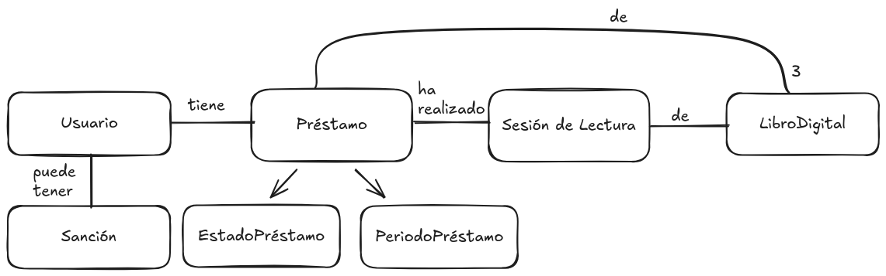
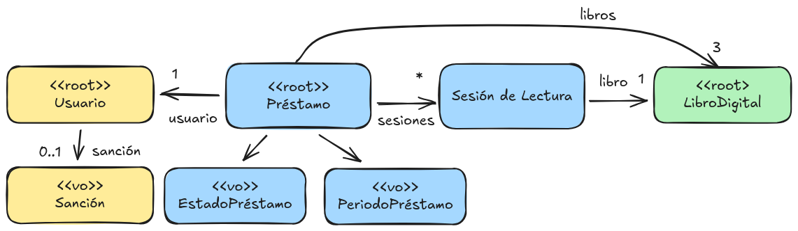

# Ejemplo sobre DDD - Préstamos de libros

Dado el enunciado que se muestra a continuación describiendo un dominio para el cual se desea construir una sistema
tu tarea es diseñar el sistema utilizando las técnicas de Domain-Driven Design. 
Para ello, en este ejercicio debes:

1. Identificar los elementos del lenguaje ubicuo. Incluir un glosario de los elementos más importantes y cualquier diagrama útil.
2. Identificar historias de usuario.
3. Crear un modelo de dominio "ligero" para entender los conceptos. Identificar las reglas de negocio.
4. Realizar el diseño táctico del sistema según DDD. 
   4.1. Realizar un modelo de dominio identificando entidades, value objects y servicios de dominio. Expresalo como un diagrama de clases.
   4.2. Identifica los agregados. 
   4.3. Asignar reglas de negocio
5. Identificar los servicios de aplicación a partir de las historias de usuario. ¿Qué elementos del modelo de dominio se coordinan en estos servicios?

Los puntos 1, 2 y 3 sirven para entender el dominio del problema. Este análisis hay que trasladarlo a un diseño software en el punto 4.
Se recomienda hacer los puntos 1, 2 y 3 de manera conjunta, entonces refinarlo para hacer el punto 4.1. A partir de ahí se pueden hacer 
los puntos 4.2, 4.3 y 5. En todo caso, se debe abordar como un proceso iterativo.

## Enunciado

> Una biblioteca digital desea desarrollar una aplicación para gestionar el 
> **préstamo de libros electrónicos**. 
> 
> Cada **libro digital** puede prestarse a un único **usuario** a la vez. No se pueden realizar préstamos a usuarios que están sancionados.
> Un **préstamo** tiene una fecha de inicio y una fecha de vencimiento y puede tener hasta 3 libros digitales. 
> 
> Durante un préstamo se registran **sesiones de lectura**, cada una con una hora de inicio y una hora de fin. 
> El **tiempo total de lectura** de un préstamo se calcula como la suma de las duraciones de sus sesiones de lectura. 
>
> Si al terminar una sesión de lectura (ej., cuando sale del lector de libros electrónicos) el tiempo total de lectura excede de 25 horas, el préstamo completo se cancela y no se puede acceder de nuevo a ninguno de los libros del préstamo.
> 
> Un libro no puede prestarse si ya está prestado.


## 1. Lenguage ubicuo

| Término       | Descripción |
|---------------|-------------|
| Libro digital | Libro disponible en formato electrónico |
| Usuario       | Persona registrada en la biblioteca |
| Préstamo      | Cesión temporal de hasta 3 libros a un usuario |
| Periodo de préstamo | Intervalo de fechas del préstamo |
| Sesión de lectura | Intervalo en que el usuario está leyendo, hasta salir del lector |
| Tiempo total de lectura | Suma de duraciones del préstamo |


## 2. Historias de usuario

* Como usuario, quiero solicitar un préstamo de libros digitales para poder leerlos durante un periodo limitado.
* Como usuario, quiero notificar cuando se inicia una sesión de lectura (al abrir el libro) y cuando termina (al realizar la acción de salir del lector).

## 3. Modelo de dominio



Hay algunas reglas de negocio que hay que tener en cuenta para luego asignarla a objetos del modelo de dominio:

- *R1*: Un libro digital no puede prestarse si ya está prestado.
- *R2*: Un libro digital no puede prestarse si el usuario está sancionado.
- *R3*: Un préstamo puede tener como máximo 3 libros digitales.
- *R4*: Si el tiempo total de lectura supera las 25 horas, el préstamo se cancela

## 4. Diseño con DDD

Partiendo del modelo anterior, podemos crear un diseño más detallado. En particular nos interesa discutir cuáles 
son las entidades y los _value objects_ y cómo se organizan en agregados. También queremos identificar los servicios de dominio.

El siguiente diagram es un resumen del diseño propuesto. Se utilizan colores para identificar los agregados.



Nota: Para simplificar el problema, en esta solución no se discute cómo se establecen las sanciones.

### Agregados

- Un `Usuario` es un agregado con una única entidad. Decidimos identificarlo por DNI (otras opciones son posibles).
- Un `Préstamo` es la raiz de un agregado que contiene sesiones de lectura.  
- Un `LibroDigital` es un agregado con una única entidad.

*Discusión:*
- Un `Usuario` podría ser la raíz de un agregado que contuviera `Prestamos`. Sin embargo durante la vida de un usuario
podrían haber muchos préstamos. Por tanto, para acceder a un solo préstamos habría que todo el objeto usuario (y sus préstamos).
Igualmente, para manipular un `Usuario` en la mayoría de los casos no se deseará tener acceso a todos los préstamos.
- El `LibroDigital` no puede ser parte del agregado `Prestamo` puesto que su ciclo de vida es distinto y 
  sus invariantes (si los hubiera) no tienen relación con el `Prestamo`.

### Asignar reglas de negocio

R1 y R2. Para garantizar que un libro no puede prestarse si ya está prestado es necesario tener acceso global a los préstamos.
    Por tanto, esta información no está accesible desde el `Usuario` (que sería un lugar lógico para tener un método factoría
    que creara un préstamo si se dan las condiciones). Por ejemplo, se decide crear un servicio de dominio `ServicioPrestamo`
    que aplique esta regla de negocio.

```java
public class SolicitudPrestamoServicioDominio {

    private final PrestamoRepository prestamoRepository;

    @CheckForNull
    public Prestamo realizarPrestamo(Usuario usuario, LibroDigitalId libroId) {
        // R1: No se puede prestar el libro si ya está prestado
        if (prestamoRepository.estaLibroPrestado(libroId)) {
            // ALTERNATIVA: Podríamos lanzar una excepción para indicarlo o usar Optional
            return null;
        }

        // R2: No se puede prestar el libro si el usuario está sancionado
        if (usuario.estaSancionado()) {
          return null;
        }

        Prestamo prestamo = prestamoRepository.findByUsuario(usuario.getId());
        if (prestamo == null) {
          // Se construye un prestamo que es válido de entrada porque tiene un libro
          prestamo = new Prestamo(usuario.getId(), libroId);
        } else {
          // Usamos el lenguaje ubicuo (no addLibro)
          // Extender prestamo comprobará R3
          prestamo.extenderPrestamo(libroId);
        }
        return prestamo;

        // Una alternativa es dejar la gestión de las sanciones dentro del usuario
        // con un método usuario.realizarPrestamo() (una factoría) y un método usuario.extenderPrestamo().
        // Se ha decido hacerlo todo en el servicio para encapsular en un único lugar toda la lógica de préstamo.
    }
}
```

R3. Esta regla se asigna al agregado `Prestamo` puesto que contiene la información sobre los libros prestados.

R4. Para asegurar esta regla es necesario pensar un protocolo de inicio y fin de sesiones, por tanto se dedice crear estos métodos:

```java
public class Prestamo {
  private boolean cancelado = false;
  private List<SesionPrestamo> sesiones;
  private SesionLectura sesionActiva = null;

  public void iniciarSesion(LibroId libro) {
    Preconditions.checkState(sesionActiva == null);
    Preconditions.checkState(! cancelado);
    SesionLectura sesion = new SesionPrestamo(libro);
    // El construir de SesiónPrestamo se encargará de guardar fecha y hora
    sesiones.add(sesion);
  }

  public void terminarSesion(LibroId libro) {
    Preconditions.checkState(sesionActiva != null && sesionActiva.getLibro().equals(libro));
    sesionActiva.terminar();
    if (tiempoTotalLectura() > 25) {
      this.cancelado = true;
    }
  }
}
```

## 5. Servicios de aplicación

A partir de las historias de usuario podemos derivar tres servicios de aplicación
(se incluyen ambos dentro de la misma clase).

```java
public class ServicioBiblioteca {
  private SolicitudPrestamoServicioDominio servicioPrestamo;


  public void prestarLibro(UsuarioId usuarioId, LibroId libroId) {
    Usuario usuario = repoUsuarios.findById(usuarioId);
    Preconditions.checkNotNull(usuario);

    Prestamo prestamo = servicioPrestamo.realizarPrestamo(usuario, libroId);
    if (prestamo == null) {
      // Ha habido un error, no se puede prestar, notificar
    } else {
      repoPrestamos.save(prestamo);
    }
  }

  // Los parámetros de estos métodos pueden variar dependiendo de cómo el lector de libros
  // obtenga los libros, pero asumamos que simplemente envía el identificador del libro que se está leyendo.
  public void notificarInicioSesion(LibroId libro) {
    Prestamo prestamo = repoPrestamos.findByLibroId(libro);
    Preconditions.checkNotNull(prestamo);

    prestamo.iniciarSesion();
    repoPrestamos.save(prestamo);
  }

  public void notificarFinSesion(LibroId libro) {
    Prestamo prestamo = repoPrestamos.findByLibroId(libro);
    Preconditions.checkNotNull(prestamo);

    prestamo.terminarSesion();
    repoPrestamos.save(prestamo);
    // TODO: Aquí posiblemente habría que manejar eventos para sancionar al usuario
  }
}
```
