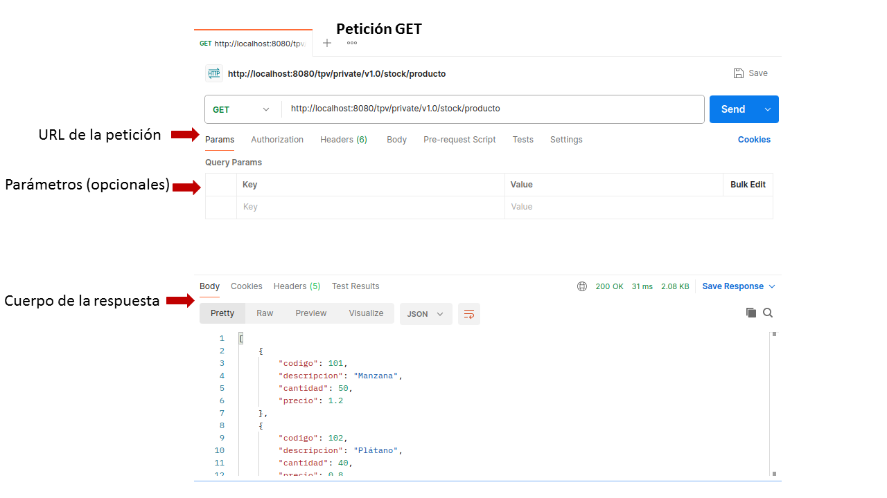
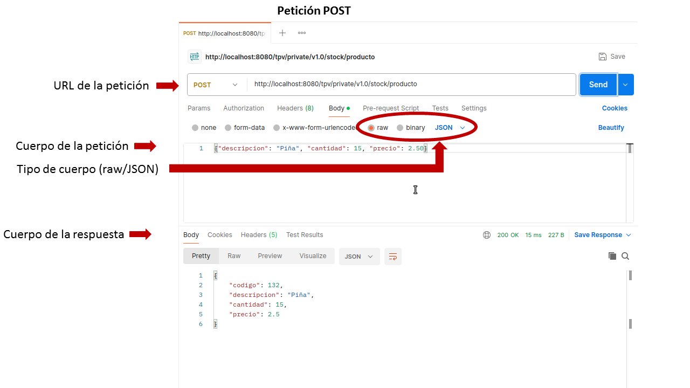

# Tutorial rápido de Postman

Cuando necesitamos hacer peticiones HTTP para probar un servicio, una de las herramientas más útiles es **Postman**. Es una aplicación que nos permite enviar peticiones HTTP de manera sencilla y ver las respuestas de forma clara.

La URL para descargar Postman es: https://www.postman.com/downloads/

*Importante*: Es importante descargar la versión de escritorio, no la extensión para el navegador (_Postman agent_), ya que esta última tiene limitaciones.

## Enviar una petición GET

Una petición GET simplemente devuelve los datos de un recurso dado.

Por ejemplo:

* URL: http://localhost:8080/tpv/private/v1.0/stock/producto

Con Curl haríamos lo siguiente (el comando `jq` es para formatear JSON):

```
curl -s http://localhost:8080/tpv/private/v1.0/stock/producto | jq
```

En **Postman** se haría tal y como se muestra en la siguiente imagen. 
Se introduce la URL del servicio. No hace falta cuerpo de la petición porque
las peticiones GET son solo para obtener datos. Se pueden pasar parámetros
(pestaña "Query params")



## Enviar una petición POST

Una petición POST se utiliza para enviar datos al servidor, por ejemplo, normalmente para crear un nuevo recurso.

Las peticiones POST tienen un cuerpo (body) que contiene los datos que queremos enviar al servidor. Lo habitual
es enviar datos en formato JSON y por tanto hay que indicar al servidor que el formato de los datos es JSON. 

Si lo hacemos con Curl, el comando sería como en el ejemplo siguiente. Se indica el tipo de petición con `-X POST`, se añade la
cabecera `Content-Type: application/json` para indicar que el cuerpo de la petición es JSON, y se incluye el cuerpo de la petición con `-d`.

```
curl -s -X POST http://localhost:8080/tpv/private/v1.0/stock/producto \
  -H "Content-Type: application/json" \
  -d '{"descripcion": "Piña", "cantidad": 15, "precio": 2.50}' | jq
```

En el caso de Postman, también podemos añadir la cabecera "Content-Type" en la pestaña "Headers" y luego
en la pestaña "Body" seleccionar el formato "raw". Sin embargo, Postman tiene una funcionalidad que detecta automáticamente el formato del cuerpo de la petición. Si seleccionamos el formato "JSON" en la pestaña "Body", Postman añadirá automáticamente la cabecera "Content-Type: application/json".




## Otras peticiones

Para el resto de peticiones el funcionamiento es similar. En el caso de las peticiones PUT, se utilizan para actualizar un recurso existente, y también llevan un cuerpo con los datos a actualizar. Las peticiones DELETE se utilizan para eliminar un recurso y normalmente no llevan cuerpo.

